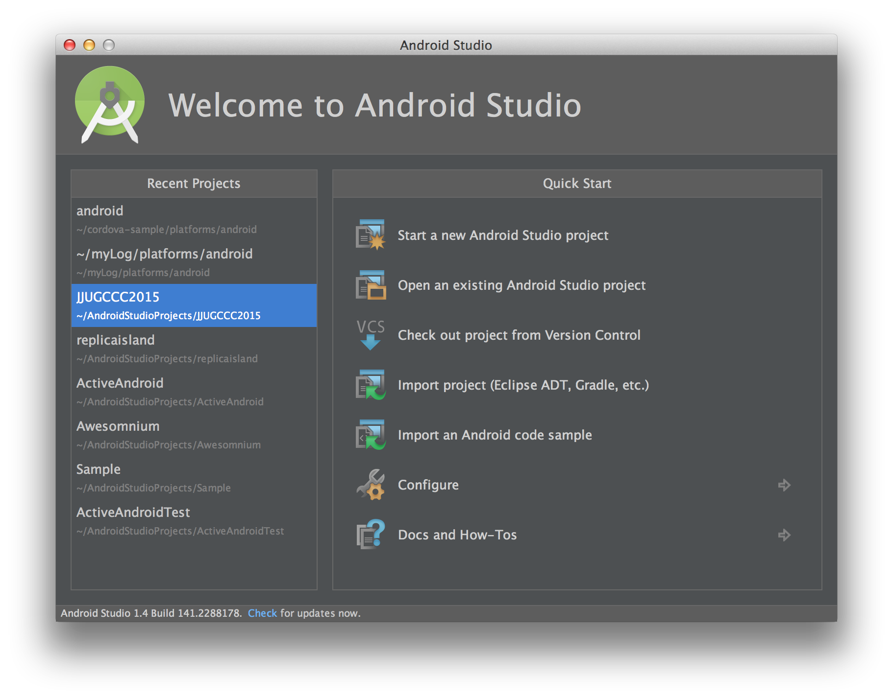
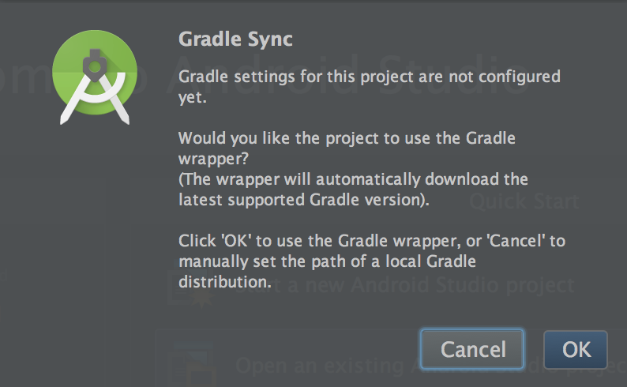
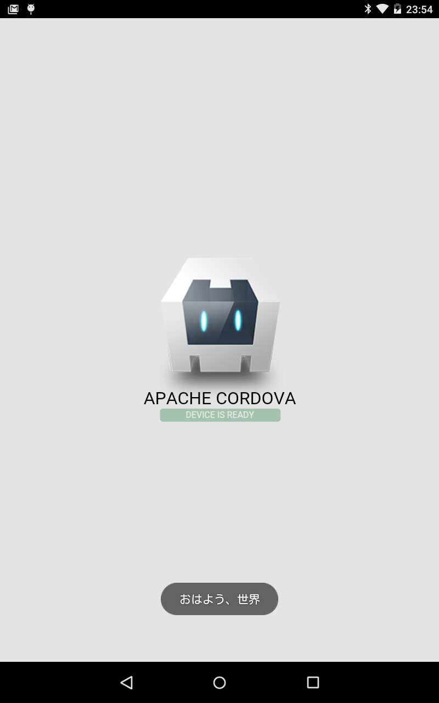

# Cordovaでプラグインの作り方

## プロジェクト作成

    create cordova-plugin-sample

## Android プロジェクトの作成

    cordova platform add android

## Android StudioでAndroid ProjectをOpen

Android Stuidを起動して、Open an existing Android Studio Projectを選択。

「cordova-plugin-sample/platforms/android/build.gradle」
を選択する。
Gradle Syncのダイアログが出たら、OK

これでAndroid StudioでAndroid Projectを取り込める。

## config.xml にプラグイン情報を追加

cordova-plugin-sample/platforms/android/res/xml/config.xml を開いて、プラグイン情報を追加

    <feature name="MyPlugin">
        <param name="android-package" value="io.cordova.hellocordova.MyPlugin" />
    </feature>

なお、このconfig.xmlは「cordova prepare」コマンドを叩いたら編集した内容が消えるので注意。

## MyPluginクラスを作成します。

cordova-plugin-sample/platforms/android/src/io/cordova/hellocordova ディレクトリに以下のクラスを作成。

    package io.cordova.hellocordova;

    import android.widget.Toast;

    import org.apache.cordova.CallbackContext;
    import org.apache.cordova.CordovaPlugin;
    import org.json.JSONArray;
    import org.json.JSONException;

    public class MyPlugin extends CordovaPlugin {

        @Override
        public boolean execute(String action,
                               JSONArray args,
                               CallbackContext callbackContext)
                throws JSONException {

            callbackContext.success();

            Toast.makeText(
                    this.cordova.getActivity(),
                    args.getString(0),
                    Toast.LENGTH_LONG).show();

            return true;
        }
    }

## index.jsからMyPluginを呼び出す。

    cordova.exec(
      function() { console.log("success") },
      function() { console.log("fail") },
      "MyPlugin",
      "test",
      ["おはよう、世界"]
    )

## おはよう、世界

